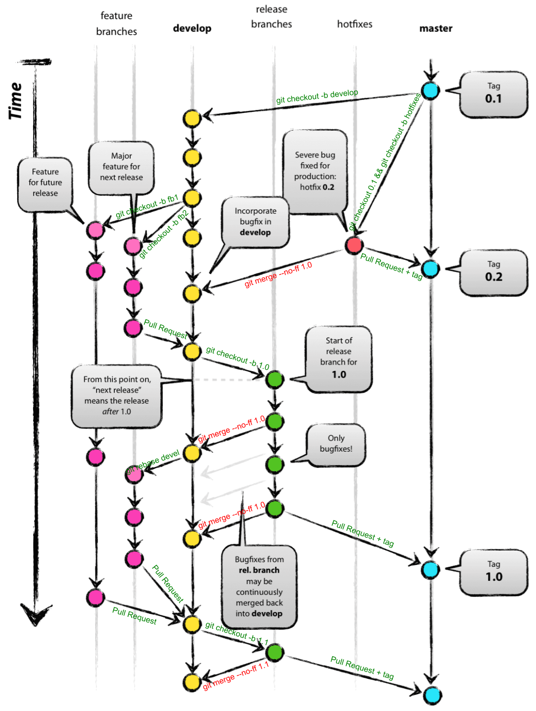

# Git

## Overview
- **Distributed** Version Control System.
- Mostly used at Source Code Management.
- Created by Linus Torvalds in 2005.
- Latest version 2.16.
- No master or hierarchy --> projects can be easily forked.

## Difficulties
- Really powerful tool that can manage from local individual project to very large decentralized project (Linux).
- Feature reach tool that lead to complexity.
- Can be used completely with different manners/workflows.

# Git workflow

- Master reflects what has been delivered to production.
- Devel reflects the latest development that will be included in the next release.
- Master and devel branch should be protected. (commit cannot be done directly on the branch).
http://nvie.com/posts/a-successful-git-branching-model/

Proposal: feature owner will do the synchronization of feature branch.

# Pull request
- All bugs, requests, features, ideas should be tracked into Jira tickets.
- A release is a group of tickets that needs to be included and completed.
- Use pull requests to review code by peers.


:
:
:
:
:
:

- Close Jira tickets with merge commit id.

Proposal: reviewer of the PR will do the post synchronizations of branches.

# Git zones


http://ndpsoftware.com/git-cheatsheet.html


# Best practices

## Configure your git correctly
```
git config --global user.name <name>
git config --global user.email <email>
```

Do the above configuration on each machine you will use.


Use ssh:
- Setup your pubkey in bitbucket
- Setup ssh-agent to avoid typing passwords
- Update the remote definition of the repository from https to ssh using `git remote set-url origine <ssh url>`
- Check with `git remote -v`

Use a difftool:
- Setup a diff tool like vimdiff or meld. Note Jean Aymeric is a master of meld.

## **Use** and abuse branches !
- Always create a branch with a **topic** (feature, fix, ...).
- Bitbucket, Github will use a branch to track your PR.
- New branches can be created super easily !
- Unsure about something, test it on a new branch.
- But branch should not last for long and should be **deleted** !

```
git checkout -b <branch name>
```

## Save your work on a remote branch
- Easy recover if you through away commits (`git reset --hard <old commit>`) but finally need them.
- Your local PC can crash !

## Commits
- Do small commits.
- Commit often.
- Avoid large commit, love your reviewer.
- Commit instead of stash.

## Commit by topic
- Use `git add -p`.
- Refine commit with the lazer !
- Avoid `git add -A` or `git commit -a`.
- Use `git reset <file>` if mistake.
- Use `git diff --cached` to check what will be in the commit.

## Do not commit
- Secrets (private key, aws keys, etc...)
- Avoid binaries

## Synchronization, keep history as clean as possible
- First thing you should do starting your job.
- Use `git remote update`.
- Rebase, rebase, rebase !
- Never pull or use `git pull --rebase` ;) .
- Really Avoid merge.
- Branch finished, use `git merge --no-ff` this will create a merge commit and show that modifications are coming from a branch with a topic.

## Think and clean before push
- Refine/clean your local history using `git rebase -i <commit>`.
- Do not push like monkey on a permanent/public remote branch !
- Things pushed to a remote branch can be extremely hard to correct. This is the danger zone !
- Could lead to massive impact on developer work relying on this remote branch.
- Never `git push --force` on a permanent/public branch !
- A warning must ring in your head before using --force.

## Conflicts
- Use difftool to help resolve them.
- If you know that you should keep your file use : `git checkout --ours <path/file>`
- If you know that you should keep remote file use : `git checkout --theirs <path/file>`

# Contribute to improve this doc

# Thanks!

