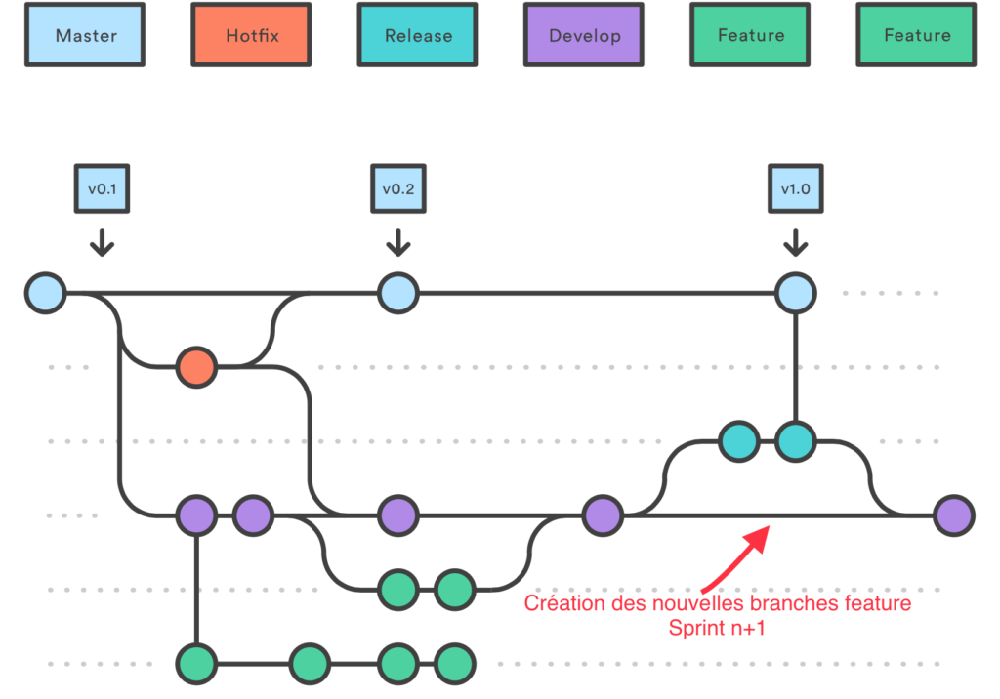

# Git

## Overview

- **Distributed** Version Control System.
- Mostly used at Source Code Management.
- Created by Linus Torvalds in 2005.
- Latest version 2.16.
- No master or hierarchy --> projects can be easily forked.

## Difficulties

- Really powerful tool that can manage from local individual project to very large decentralized project (Linux).
- Feature reach tool that lead to complexity.
- Can be used completely with different manners/workflows.

# TLDR

- Always use a branch to work `git checkout -b <branch name>`. Recommendation branch name should contain the jira ticket. 
- Synchronize your branch with devel every day using `git remote update` and `git rebase origin/devel`.
- Create commits by topics. Use `git add -p` to select what should be part of the commit.
- If needed, rebase your commits to cleanup history, before pushing your branch using `git rebase -i <previous commit>`.
- Open a PR and set your peers for review, make sure your PR pass the CI process and sonar report is fine with your new code.
- Peers to review the PR and merge as soon as ready.
- If needed (merge to master), tag the branch through bitbucket or using an annotate commit `git tag -a -m "<msg>'`

## Git workflow


- master reflects what has been delivered to production and *deployed* to production server.
- release/\* reflects the version that will be delivered or has been delivered to customer, but not yet *deployed* on production servers.
- devel reflects the latest development that will be included in the next release.
- master, release/\* and devel branches are protected. (push cannot be done directly on the branch).


http://nvie.com/posts/a-successful-git-branching-model/

## Feature branch

- Create a local branch from **devel** `git checkout -b feature/my_feature`.
- Develop your code, try to introduce tests to cover new code.
- Push your branch to the remote `git push --set-upstream origin feature/my_feature`.
- Open a PR from feature/my_feature to devel.
- You can follow pipeline execution whithin Jenkins. Your code should pass successfully in the pipeline.
- Also check sonar output to ensure produced code is free from critical bugs and vulnerabilities.
- If pipeline successful, your reviewer can merge the PR into devel.


## Release branch

Initial branch creation.

- Create a local branch from **master** `git checkout -b release/release_name`.
- Push your branch to the remote `git push --set-upstream origin feature/release_name`.

Merge content from **devel**.

- Open a PR from devel desired state to release/release_name.
- Merge the PR and tag the merge commit to the required version.
- Also tag the commit before the merge commit to release_name_SNAPSHOT.



## Hotfix branch

Add fixes on top of either a release branch or master branch.

- Create a local branch from **release** or **master** `git checkout -b fix/topic`.
- Push your branch to the remote `git push --set-upstream origin fix/topic`.
- Open a PR from fix/topic to release or hotfix.
- Remove the release branch as soon as the code is deployed on production environment.


## Backport features from release or hotfix branches to devel

**Only people with push rights can do this part.**

- Merge fixes back to devel. `git merge --no-ff release/release_name


# Pull request

- All bugs, requests, features, ideas should be tracked into Jira tickets.
- A release is a group of tickets that needs to be included and completed.
- Use pull requests to review code by peers.


- Close Jira tickets with merge commit id.

Proposal: reviewer of the PR will do the post synchronizations of branches.

# Git zones


http://ndpsoftware.com/git-cheatsheet.html


# Best practices

## Configure your git correctly

```sh
git config --global user.name <name>
git config --global user.email <email>
```

Do the above configuration on each machine you will use.


Use ssh:

- Setup your pubkey in bitbucket
- Setup ssh-agent to avoid typing passwords
- Update the remote definition of the repository from https to ssh using `git remote set-url origine <ssh url>`
- Check with `git remote -v`

Use a difftool:

- Setup a diff tool like vimdiff or meld. Note Jean Aymeric is a master of meld.

## **Use** and abuse branches !

- Always create a branch with a **topic** (feature, fix, ...).
- Bitbucket, Github will use a branch to track your PR.
- New branches can be created super easily !
- Unsure about something, test it on a new branch.
- But branch should not last for long and should be **deleted** !

```sh
git checkout -b <branch name>
```

## Save your work on a remote branch

- Easy recover if you throw away commits (`git reset --hard <old commit>`) but finally need them.
- Your local PC can crash !

```sh
git push --set-upstream origin <branch name>
```

## Commits

- Do small commits.
- Commit often.
- Avoid large commit, love your reviewer.
- Commit instead of stash.

## Commit by topic

- Use `git add -p`.
- Refine commit with the lazer !
- Avoid `git add -A` or `git commit -a`.
- Use `git reset <file>` if mistake.
- Use `git diff --cached` to check what will be in the commit.

## Do not commit

- Secrets (private key, aws keys, etc...)
- Avoid binaries

## Synchronization, keep history as clean as possible

- First thing you should do starting your job.
- Use `git remote update`.
- Rebase, rebase, rebase !
- Never pull or use `git pull --rebase` ;) .
- Really Avoid merge.
- Branch finished, use `git merge --no-ff` this will create a merge commit and show that modifications are coming from a branch with a topic.

## Think and clean before push

- Refine/clean your local history using `git rebase -i <commit>`.
- Do not push like monkey on a permanent/public remote branch !
- Things pushed to a remote branch can be extremely hard to correct. This is the danger zone !
- Could lead to massive impact on developer work relying on this remote branch.
- Never `git push --force` on a permanent/public branch !
- A warning must ring in your head before using --force.

## Conflicts

- Use difftool or better mergetool to help resolving them.
- If you need to restart the merging process from scratch on one file, use `git checkout -m <path/file>`.
- If you know that you should keep your file use : `git checkout --ours <path/file>`.
- If you know that you should keep remote file use : `git checkout --theirs <path/file>`.

# Contribute to improve this doc

# Thanks!

